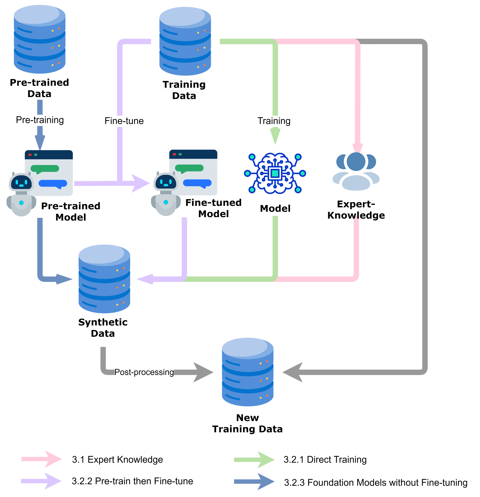

# 😊 A Survey of Data Synthesis Approaches
<!-- - [arXiv paper]()-->

<!-- toc -->
## Overview of *A Survey of Data Synthesis Approaches*
  * [Pipeline of Synthesizing Data](#pipeline-of-synthesizing-data)
  * [Augmentation Objectives](#augmentation-objectives)
    + [Enhancing Diversity](#1-enhancing-diversity)
    + [Balancing Data Sets](#2-balancing-data-sets)
    + [Addressing Domain Shifts](#3-addressing-domain-shifts)
    + [Managing Edge Cases](#4-managing-edge-cases)
  * [Augmentation Approaches](#augmentation-approaches)
    + [Leveraging Expert Knowledge](#1-leveraging-expert-knowledge)
    + [Direct Model Training](#2-direct-model-training)
    + [Pre-training followed by Fine-tuning](#3-pre-training-followed-by-fine-tuning)
    + [Utilizing Foundation Models without Fine-tuning](#4-utilizing-foundation-models-without-fine-tuning)
  * [Post-Processing](#post-processing)
    + [Ensuring Basic Quality](#1-ensuring-basic-quality)
    + [Maintaining Label Consistency](#2-maintaining-label-consistency)
    + [Aligning Data Distribution](#3-aligning-data-distribution)
- [Future Work](https://github.com/MiuLab/SynData-Survey/edit/main/README.md#future-work)
  * [Shifting Focus from Quantity to Quality](#1-shifting-focus-from-quantity-to-quality)
  * [Evaluating the Impact of Augmented Data](#2-evaluating-the-impact-of-augmented-data)
  * [Expanding to Multi-Modal Data Augmentation](#3-expanding-to-multi-modal-data-augmentation)

<!-- tocstop -->
- - -
### Pipeline of Synthesizing Data
1. Augmentation Objectives: Identifying needs for synthetic data
2. Synthetic Data Generation: Creating synthetic data using various methods
3. Post-Processing: Refining and ensuring the quality of generated data

### Augmentation Objectives
We categorize these objectives into four types: Improving Diversity, Data Balancing, Addressing Domain Shift, or Resolving Edge Cases. A single data augmentation method may not be limited to addressing only one of the objectives mentioned above.

#### 1. **Enhancing Diversity**:
Reduce the possibility of overfitting, resulting in better generalization capabilities.
 - [Cubuk et al. (2020)](https://arxiv.org/abs/1909.13719)：employs random sampling of transformation subsets
 - [Liu et al. (2024b)](https://arxiv.org/abs/2404.00361)：leverages the LLMs’ in-context learning capability
 - [Wang et al. (2023)](https://aclanthology.org/2023.acl-long.754/)：utilizes Rouge-L to examine the similarity between generated data

#### 2. **Balancing Data Sets**:
Providing more balanced training data for minority classes.
  - Rresampling or synthetic data generation
  [SMOTE (Chawla et al., 2002)](https://doi.org/10.1613/jair.953), [ADASYN (He et al., 2008)](https://doi.org/10.1109/IJCNN.2008.4633969)

#### 3. **Addressing Domain Shifts**:
To adapt to the differences in data distribution between the different domain tasks.
  - [Chen et al. (2021)](https://arxiv.org/abs/2109.01758)：adding noise to input sentences and transforming sentence formats between different domains.
  - [Orbes-Arteaga et al. (2022)](https://arxiv.org/abs/2202.11486)：consistency training and adversarial learning

#### 4. **Managing Edge Cases**:
Expand the variety of training data by introducing rare but plausible scenario.
 - Simulating various real-world perturbations and anomalies [(Yudkin et al., 2022)](https://arxiv.org/abs/2206.00148)

### Augmentation Approaches
We introduce various approaches to generate synthetic data, and categorize these approaches into four types: Expert Knowledge, Direct Training, Pre-train then Fine-tune, and Foundation Models without Fine-tuning. Techniques for generating synthetic data often align with the prevailing machine learning methodologies of their time.

    

#### 1. **Leveraging Expert Knowledge**
  - *Creation*: The methods include synonym replacement ([Wei and Zou, 2019](https://aclanthology.org/2023.acl-long.754.pdf); [Zhang et al., 2016](https://arxiv.org/abs/1509.01626)), or random inserion of words ([Zhu et al., 2022](https://aclanthology.org/2023.acl-long.754.pdf)).
  - *Transformation*: The methods include dispersing punctuation marks throughout the text ([Karimi et al., 2021](https://arxiv.org/abs/2108.13230)), changing the structure or format of the original text.
  - *Hybrid*: Mapping the data from a specific domain to the distribution of a general domain, and conducting data augmentation by finding similar data in the general domain, is equivalent to combining feature transformation and feature creation. ([Chen et al., 2021](https://arxiv.org/abs/2109.01758))

      * **Limitations**:
          1. Performance gain can be marginal when data is sufficient. 
          2. Knowledge-based engineering often involves generating synthetic samples by synonym replacement or structural adjustments, which will not change the label of the original dataset, so the imbalance in the dataset remains.
      * **Advantages**:
          1. Fast and simple.
          2. Performance gain in small dataset is clear.

#### 2. **Direct Model Training**
Before the widespread adoption of pre-trained models, we often develop a model that is trained exclusively on data specific to the task at hand for synthesizing new data. The key characteristic of this approach is that the augmentation model does not leverage any pre-existing models or datasets; it starts from scratch, learning exclusively from the task-specific dataset.
  - RNN [(Kobayashi, 2018)](https://arxiv.org/abs/1805.06201), [(Xu et al.,2016)](https://arxiv.org/abs/1601.03651), [(Fadaee wt al., 2017)](https://doi.org/10.18653/v1/p17-2090)
  - CNN [(Guo et al., 2019)](https://arxiv.org/abs/1905.08941)
    
  - **Limitations**:
  The main limitation is its reliance on large amounts of labeled data for training, which is not always readily available.
  - **Advantages**:
  Trained models generate more diverse and realistic data than knowledge-based engineering methods, which can help improve the robustness and generalization of the main model.

#### 3. **Pre-training followed by Fine-tuning**
This section covers augmentation techniques under the pre-train then fine-tune paradigm.  During pre-training, a model learns meaningful data
representations on a large related dataset using unsupervised learning. Then, the pre-trained model is fine-tuned on a smaller labeled dataset for the target task, adapting its parameters to that specific task.
  - **Limitations**:
  Pre-trained models are prone to overfitting on small amounts of data, leading to domain shift when used for data augmentation.
  - **Advantages**:
  Compared to direct training, pre-trained models don’t require extensive data for fine-tuning to achieve similar or even superior performance. Especially when used for data augmentation, there is often a shortage of data.

#### 4. **Utilizing Foundation Models without Fine-tuning**
Companies have published foundation models that often exhibit excellent performance on downstream tasks without the need for  additional fine-tuning. Using prompt design, for example: zero-shot,, in-context learning, dialogue with LLM, to synthetic data earns a lot of popularity.
  - **Limitations**:
  The synthetic data generated by foundation models may not be as tailored to specific domain needs compared to data from fine-tuned models. This can lead to less accurate or less effective data for training down-stream models.
  - **Advantages**:
  Using foundation models directly allows for quicker deployment because there’s no need for an additional fine-tuning phase.

### Post-Processing

#### 1. **Ensuring Basic Quality**
Basic quality encompasses elements such as fluency, grammatical accuracy, format validation among others. 
    - Fluency
    Using [SLOR](http://arxiv.org/abs/1809.08731) metric to evaluate fluency.
    Using GPT-4 to mimic human evaluations [(Abdulin et al.)](https://arxiv.org/abs/2401.17461).
    - Format validation
    Regular expression to ensure the correct format [(Lee et al.)](https://aclanthology.org/2022.ccgpk-1.4/)

#### 2. **Maintaining Label Consistency**
To avoid the discrepancies between the data and
its labels.
    - Train a classifier to filter generated context ([Zhou et al.](https://arxiv.org/abs/2108.06332), [Anaby-Tavor et al.](https://arxiv.org/abs/1911.03118), [Puri et al.](https://arxiv.org/abs/2002.09599))

#### 3. **Aligning Data Distribution**
To enhance the diversity and generalizability of synthetic dataset. 
    - Filtered out data with high similarity [(Wang et al.)](https://aclanthology.org/2023.acl-long.754/)
    - Solve class imbalance by with diverse data using similarity score [(Suhaeni and Yong 2023)](https://www.mdpi.com/2076-3417/13/17/9766)

### Future Work

#### 1. **Shifting Focus from Quantity to Quality**
As the volume of data reaches a certain threshold, the incremental gains in model performance begin to diminish. The emerging trend is toward enabling models to learn effectively from smaller but high quality datasets.
#### 2. **Evaluating the Impact of Augmented Data**
Creating a standard benchmark for evaluating data
augmentation techniques-focusing on their quality, diversity, and relevance—is a key but complex
challenge in advancing machine learning. Despite these difficulties, creating a strong benchmark is crucial as it could greatly help in developing more effective and flexible augmentation methods
#### 3. **Expanding to Multi-Modal Data Augmentation**
Currently, there are relatively few studies that focus
on multi-modal data augmentation, even though
this area holds significant potential for enhancing
model performance in complex task

## Citation
